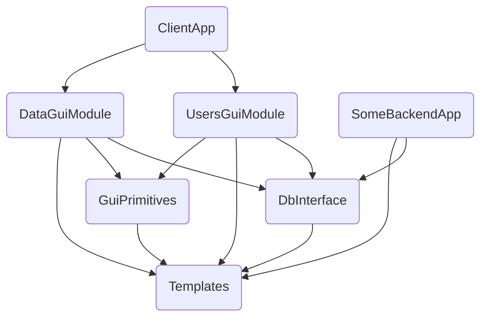

# Как мы навели порядок в проекте с помощью Conan

## Пару слов о проекте

Максимально коротко: мы создам систему по обмену аэронавигационной информацией между филиалами организации, которая разрабатывает и поддерживает структуру воздушного пространства в РФ. Система распределенная в каждом филиале установлен автономный комплекс. Комплексы из разных филиалах обмениваются между собой изменениями информации. 

Теперь подробнее о комплексе: комплекс представляет из себя несколько железных серверов в кластере, на котором работает набор backend сервисов (CentOS), и несколько рабочих мест операторов (ПК на Windows). На рабочих местах установлено Desktop приложение на C++/Qt, которое взаимодйствует с backend'ом. Система разрабатывается уже много лет, поэтому мы имеем неплохой багаж legacy. 

Desktop приложение модульное, главный ui подгружает из динамических библиотек интерфейсы для выполнения различных задач. Каждый отдельный модуль имеет свою либу. Кроме того модули используют общий код доступа к БД, к backend сервисам, который (общий код) также выдлен в отдельные либы.

Некоторые backend сервисы также написаны на C++/Qt и используют библиотеки доступа к БД, те же самые, которые использует Desktop приложение.

В итоге если упростить получается примерно следующее

На самом деле приложений, включая backend сервисы - 4, внутренних lib 15, GUI модулей 15. Кроме того, для разработчика удобно запускать определенный GUI модуль отдельно от всего приложения - изолированно, для этого ему нужны актуальные версии всех внутренних либ. По этой диаграмме можно примерно представить граф зависимостей.

Сразу оговорюсь, что цель статьи - рассказать, о том как нам удалось выстроить достаточно стабильный flow работы, поэтому попрошу не холиварить на тему "Все надо по другому", а конструктив я с радостью послушаю.

## Проблема с Git Flow и модульностью

Все мы знаем про Git Flow, и как надо талантливо ветвить репозиторий.

И это все прекрасно работает, пока репозиторий один. Когда итоговое desktop приложение включает себя кучу репозиториев, а некоторые из них зависят от других репозиториев, мы приходим к весьма сложной и запутанной структуре.

### Вариант 1, монорепозиторий

Много много лет назад в одной отдаленной галактике...

Когда проект стартовал, он весь состоял из desktop приложения и БД, backend сервисов тогда еще не было. Это было лет 8 назад, и Desktop приложение было в монорепозитории. В корне лежал один большой Qt `pro` файл, который через `subdirs` включал все GUI модули и внутренние либы. Все они плоско лежали в репозитории в подпапках, собирались по порядку и подключались уже бинарями. 

Плюсы:

* Все в одном месте, просто фиксить баг, который сквозит через библиотеки или делать фичу, которая сквозит через библиотеки
* Нет проблем с ветвлением

Минусы:

* Дикое время сборки
* Высокая вероятность высокой связности
* Все разработчики в одном репозитории
* Очень сложно взять либу в другой проект
* Сложно организовать изолированное приложение для одного GUI модуля

### Вариант 2, git submodules

Мы начали искать варианты разделения на отдельные репозитории. И на тот момент единственным вариантом выглядел `git submodules`. В итоге распилив мы получили, каждую либу в отдельном репозитории. Desktop приложение подключает их как сабмодули, и в принципе репа desktop приложения на вид не изменилась. Зато появилась возможность отдельно работать с gui модулем. И тут возникла новая сложность.

!!! описать проблему включения подмодулей либ, пришлось посоздавать кучу репозиториев для сэмплов, и дикая проблема с ветвлением

!!! Нарисовать диаграмму включения сабмодулей

Плюсы:

* Разбиение на модули
* Сложно фиксить баг или делать фичу, которая сквозит через несколько либ (это проблема высокой связности, поэтому сложности автоматически стимулируют лучше разделять, так что это необходимые сложности которые идут во благо)
* изолированные модули

Минусы:

* 

## Какую задачу решаем

Что нам в итоге надо

* каждая либа или gui модуль были отдельным репозиторием
* уметь управлять ветвлением, максимально прозрвчно
* билдить под разные платформы
* билдить либы изолированно
* высокая степень кастомизации

## Что нам дал Conan

## Наш Conanfile

## Примеры скриптов CI/CD

## Итоговый flow

## Плюсы и минусы