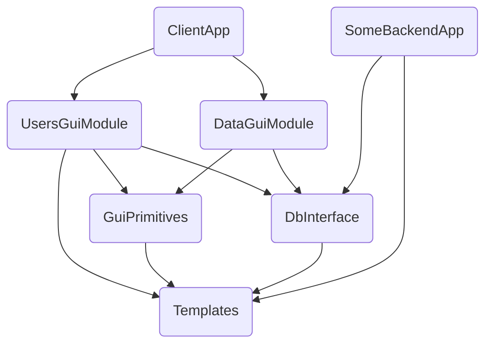
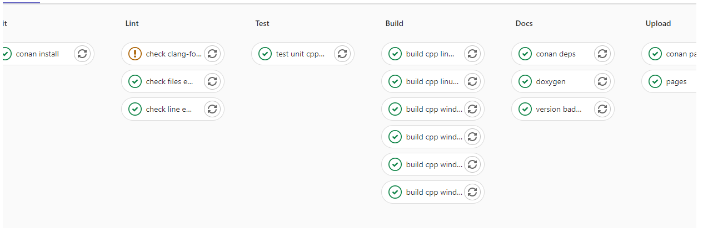

# ConanArticle

Статья про наше использование Conan для Habr.

Title: Как мы навели порядок в C++/Qt проекте с помощью Conan

Сразу оговорюсь, что цель статьи - рассказать, о том как нам удалось выстроить достаточно стабильный flow работы.

## Пару слов о проекте

Максимально коротко: мы создаем систему по обмену аэронавигационной информацией между филиалами организации, которая разрабатывает и поддерживает структуру воздушного пространства в РФ. Система распределенная в каждом филиале установлен автономный комплекс. Комплексы из разных филиалах обмениваются между собой изменениями аэронавигационной информации.

Теперь подробнее о комплексе: комплекс представляет из себя несколько железных серверов в кластере, на котором работает набор backend сервисов (CentOS), и несколько рабочих мест операторов (ПК на Windows). На рабочих местах установлено Desktop приложение на C++/Qt, которое взаимодйствует с backend'ом. Система разрабатывается уже много лет, поэтому мы имеем неплохой багаж legacy.

Desktop приложение модульное, главный ui подгружает из динамических библиотек интерфейсы для выполнения различных задач. Каждый отдельный модуль имеет свою либу (читай `dll`/`so`). Кроме того модули используют общий код доступа к БД, доступа к backend сервисам, реализация логгирования и т.д. Общий код также выдлен в отдельные либы статические и динамические.

Некоторые backend сервисы также написаны на C++/Qt и используют библиотеки доступа к БД, те же самые, которые использует Desktop приложение.

Итого имеем:

- 26 динамических библиотек (15 GUI модулей и 11 модулей с бизнес логикой)
- 11 статических библиотек
- 6 сторонних open source библиотек (докрученных для наших нужд)
- 2 Desktop приложения
- 2 backend сервиса

Все вышеперечисленное местами друг друга использует

В итоге если упростить получается примерно следующее:



Теперь эту схему масштабируем до нашего количества либ и возникает вопрос: как все это согласованно содержать и развивать?

## Проблемы, которые надо решить

- Централизованное управление всем деревом зависимостей
- Независимая разработка модулей, для разработчика удобно запускать определенный GUI модуль отдельно от всего приложения - изолированно, для этого ему нужны актуальные версии всех зависимостей
- Неплохо бы разделять `dev` и `production` вселенные и сделать удобным доступ для тестировщиков к свежим фичам, при этом случайно не выкатить в прод сырой код.
- Еще не забываем про Git Flow и ветвление: 1 фича - отдельная ветка, все знаем, что в одной ветке пилить плохо. Это все прекрасно работает, пока репозиторий один. Когда итоговое desktop приложение включает в себя кучу репозиториев, а некоторые из них зависят от других репозиториев, мы приходим к весьма сложной и запутанной структуре.
- Можно еще подумать о сокращении времени CI на build
- 2 платформы Linux/Windows и 2 версии Qt (переходные периоды в любом случае будут)
- Иногда баг сквозит через несколько либ, и надо иметь возможность дебажить сквозь несколько зависимостей

## У самурая нет цели, есть только путь

Много много лет назад в одной отдаленной галактике... мы начали искать решение.

### Вариант 1, монорепозиторий

Когда проект стартовал, он весь состоял из desktop приложения и БД, backend сервисов тогда еще не было. Это было лет 8 назад, и Desktop приложение было в монорепозитории. В корне лежал один большой Qt `pro` файл, который через `subdirs` включал все GUI модули и внутренние либы. Все они плоско лежали в репозитории в подпапках, собирались по порядку и подключались уже бинарями.

Плюсы:

- Все в одном месте, просто фиксить баг, который сквозит через библиотеки или делать фичу, которая сквозит через библиотеки
- Нет проблем с ветвлением

Минусы:

- Дикое время сборки
- Высокая вероятность высокой связности
- Все разработчики в одном репозитории
- Очень сложно взять либу в другой проект
- Сложно организовать изолированное приложение для одного GUI модуля

### Вариант 2, git submodules

Мы начали искать варианты разделения на отдельные репозитории. И на тот момент единственным вариантом выглядел `git submodules`. В итоге распилив мы получили, каждую либу в отдельном репозитории. Desktop приложение подключает их как сабмодули, и в принципе репа desktop приложения на вид не изменилась. Зато появилась возможность отдельно работать с gui модулем. И тут возникла новая сложность.


!!! описать проблему включения подмодулей либ, пришлось посоздавать кучу репозиториев для сэмплов, и дикая проблема с ветвлением

!!! Нарисовать диаграмму включения сабмодулей

Плюсы:

* Разбиение на модули
* Сложно фиксить баг или делать фичу, которая сквозит через несколько либ (это проблема высокой связности, поэтому сложности автоматически стимулируют лучше разделять, так что это необходимые сложности которые идут во благо)
* изолированные модули

Минусы:

* 


## Какую задачу решаем

Что нам в итоге надо

* каждая либа или gui модуль были отдельным репозиторием
* уметь управлять ветвлением, максимально прозрвчно
* билдить под разные платформы
* билдить либы изолированно
* высокая степень кастомизации


### Вариант 3, пакетный менеджер

И вот в один прекрасный день мой коллега нашел его:


Точнее его:


Мы потратили примерно 2 месяца на осознание, набивание шишек, построение и разрушение костылей и велосипедов. Потом пришел бизнес и сказал, что пора уже код писать.
Мы запустились на том, что получилось.
Потом еще пару лет эволюции и сейчас наша концепция выглядит вполне живой и бодрой.

## Что получилось в итоге

- Каждая библиотека и приложение лежит в своем репозитории и собирается в Conan пакет и выкладывается на Conan сервер.

### Инкапсуляция логики сборки

Вся логика сборки под разные платформы инкаспулирована в общий `conanfile.py`, который также является Conan пакетом и инклюдится в либы.
Также мы в него уложили логику прокатки unit тестов, сбора покрытия, изменение логики сборки в зависимости от того является ли библиотека header only, статической, динамической или app.

Посмотреть на наш conafile можно по ссылке ==link==.

Пример рецепта для библиотеки:

```python
from conans import ConanFile, CMake, tools
import os


class AixmDbLegacyConan(ConanFile):
    name = "AixmDbLegacy"
    version = "2.58.1"
    url = "https://git.ani/Libs/AixmDb"
    generators = "qmake"
    python_requires = "CommonConanFile/0.8@monsoft/stable"
    python_requires_extend = "CommonConanFile.DynamicLibConanFile"
    exports_sources = "src/*", "test_unit/*", "AixmDbLegacy.pro", "AixmDbLegacy_TestUnit.pro"
    run_tests_headless = False
    unit_test_executables = [
        os.sep.join([".", "test_package", "DbPrimitives", "AixmDbLegacy_Test_DbPrimitives"]),
        os.sep.join([".", "test_package", "GmlHandler", "AixmDbLegacy_Test_GmlHandler"]),
        os.sep.join([".", "test_package", "AixmDb", "AixmDbLegacy_Test_AixmDb"]),
        os.sep.join([".", "test_package", "Integrational", "AixmDbLegacy_Test_Integrational"])
    ]
    
    build_requires = (
                "CommonQmakePri/[~1.0.1]@monsoft/stable",
                "ZhrGeo/[~1.1]@monsoft/stable",
                "QTester/[~1.0.1]@monsoft/stable", # for tests
                "FakeIt/2.0.2@hinrikg/stable") # for tests
    requires =  (
                "Lib/[~2.24.0]@monsoft/stable",
                "Templates/[~1.7.2]@monsoft/stable", 
                "Sax/[~1.1]@monsoft/stable")
```

### Управление пространствами dev/prod

Идентификация пакета Conan выглядит так `Lib/[~2.24.0]@monsoft/stable`.
`<Имя пакета>/<Версия semver>@<user>/<channel>`
Все наши пакеты (которые используют общий рецепт `CommonConanFile`) из ветки `dev` собираются в канал `dev`, а из ветки `master` в канал `stale`.
Таким образом слияние фича ветки в `dev` приводит к выходу новой dev версии, при этом stable простарнство не затрагивается. При релизе мы сливаем все либы из `dev` -> `master` и получаем обновление `stable` версий пакетов.

Самая главная фичв тут в подмене канала. Все зависимости прописаны на канал `stable`, но когда мы понимаем, что собираемся в dev пространстве, то при выполнении `conan install` выставляем env, на который реагирует наш рецепт сборки, и он подменяет все пакеты `monsoft/stable` на `monsoft/dev`. Таким образом мы по всему дереву зависимостей получаем подмену канала.

У тестировщика есть команда для установки приложения через Conan из `dev` и `stable`. Ему не надо ничего собирать, ставить IDE, компилятор или еще что-то, чтобы добыть самый свежий бинарь. Разработчик прислал ветку на ревью -> ветку слили в `dev` -> прошла сборка на CI -> новая версия уже в канкале `dev` -> у тестировщика самая свежая версия.

### Отладка сквозных багов: editable пакеты 

### Дружба с IDE

## Примеры CI/CD



## Итоговый flow


## Плюсы и минусы

Само собой у подхода есть и минусы, серебряной пули не бывает
Плюсы:

Минусы:

- блокировка слияния фич перед релизом ==todo write==
- перезапуск сборок скриптами
- дополнительные дефствия для отладки сковзных багов
- определенный порог входа для разработчиков
- басфактор в поддержке
