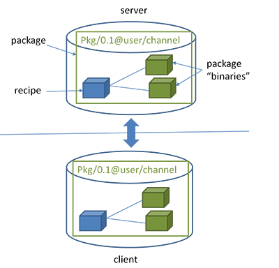

# ConanArticle

Статья про наше использование Conan для Habr.

**Title**: Как мы навели порядок в C++/Qt проекте с помощью Conan

## Пару слов о проекте

### Максимально коротко

Мы создаем систему по обмену аэронавигационной информацией между филиалами организации, которая разрабатывает и поддерживает структуру воздушного пространства в РФ. Система распределенная: в каждом филиале установлен автономный комплекс. Комплексы из разных филиалов обмениваются между собой изменениями аэронавигационной информации.

### Теперь подробнее

Комплекс представляет из себя несколько железных серверов в кластере, на котором работает набор backend сервисов, и несколько рабочих мест операторов (ПК на Windows). На рабочих местах установлено Desktop приложение на C++/Qt, которое взаимодйствует с backend'ом. Система разрабатывается уже много лет, поэтому мы имеем неплохой багаж legacy.

Desktop приложение модульное, главный UI подгружает из динамических библиотек интерфейсы для выполнения различных задач, например:

- ввод информации об аэронавигационных объектах
- управление проектами изменений (пересылка, утверждение и т.д.)
- управление пользователями системы
- управление настройками доступа пользователей к объектам
- просмотр сообщений обмена между комплексами

Каждый отдельный модуль имеет свою либу (читай `dll`/`so`). Кроме того модули используют общий код доступа к БД, доступа к backend сервисам, реализации логгирования и т.д. Общий код также выдлен в отдельные либы статические и динамические.

Некоторые backend сервисы также написаны на C++/Qt и используют библиотеки доступа к БД, те же самые, которые использует Desktop приложение.

Итого имеем на C++/Qt:

- 26 динамических библиотек (15 GUI модулей и 11 модулей с бизнес логикой)
- 11 статических библиотек
- 6 сторонних open source библиотек (докрученных для наших нужд)
- 2 Desktop приложения
- 2 backend сервиса

Все вышеперечисленное местами друг друга использует.

В итоге на упрощенном примере получается следующая карта зависимостей:


Теперь эту схему масштабируем до нашего количества либ и возникает вопрос: как все это согласованно содержать и допиливать?

## Проблемы, которые мы хотели решить

- Централизованное управление всем деревом зависимостей, типовые пайплайны сборки
- Независимая разработка модулей: для разработчика удобно запускать определенный GUI модуль отдельно от всего приложения - изолированно, для этого ему нужны актуальные версии всех зависимостей
- Неплохо бы разделять `dev` и `production` пространства и сделать удобным доступ для тестировщиков к свежим фичам, при этом случайно не выкатить в прод сырой код.
- Еще не забываем про Git Flow и ветвление: 1 фича - отдельная ветка; все мы знаем, что в одной ветке пилить плохо. Это все прекрасно работает, пока репозиторий один. Когда итоговое Desktop приложение включает в себя кучу репозиториев, а некоторые из них зависят от других репозиториев, мы приходим к весьма сложной и запутанной структуре.
- Можно еще подумать о сокращении времени CI/CD на build
- Билдить и хранить либы изолированно друг от друга
- 2 платформы Linux/Windows и минимум 2 версии Qt (переходные периоды в любом случае присутствуют)
- Иногда баг сквозит через несколько либ, и надо иметь возможность дебажить сквозь несколько зависимостей
- В основном мы используем QMake, но некоторые сторонние либы используют CMake, надо уметь с этим жить

## У самурая нет цели, есть только путь

Много много лет назад в одной отдаленной галактике... мы поняли, что так дальше жить нельзя, надо искать решение.

### Вариант 1, монорепозиторий

Когда проект стартовал, он весь состоял из Desktop приложения и БД, backend сервисов тогда еще не было. Это было лет 8 назад, и Desktop приложение было в монорепозитории. В корне лежал один большой Qt `.pro` файл, который через `subdirs` включал все GUI модули и внутренние либы. Все они плоско лежали в репозитории в подпапках, собирались по порядку и подключались уже бинарями.

Плюсы:

- Все в одном месте, просто фиксить баг, который сквозит через библиотеки или делать фичу, которая сквозит через библиотеки
- Нет проблем с ветвлением

Минусы:

- Дикое время сборки
- Высокая вероятность высокой связанности (coupling)
- Все разработчики в одном репозитории
- Очень сложно взять либу в другой проект
- Сложно организовать изолированное приложение для одного GUI модуля

### Вариант 2, git submodules

Мы начали искать варианты разделения на отдельные репозитории. И на тот момент единственным вариантом выглядел `git submodules`. В итоге распилив монорепозиторий мы получили, каждую либу в отдельном репозитории. Репозиторий главного Desktop приложения подключает их как git сабмодули, и в принципе репозиторий Desktop приложения на вид не изменился. Зато появилась возможность отдельно работать с GUI модулем. И тут возникла новая сложность.

Возникла проблема с подключением либ с общим кодом (например доступа к БД, пусть будет называться `LibDb`): если `LibDb` положить сабмодулем в каждый репозиторий использующего ее модуля, то когда мы соберем все зависимости в репозитории главного GUI приложения, у нас получится много копий `LibDb`. Кроме того при компиляции главного приложения, для каждого GUI модуля `LibDb` будет компилироваться отдельно.

Поэтому было принято другое решение: общеиспользуемые либы (такие как `LibDb`) не подключать сабмодулями в GUI модули, которые их используют. В репозиторий главного приложения уложить GUI модули и либы с общим кодом на одном уровне в корне. Тогда инклюды в GUI модулях всегда идут на шаг вверх и в папку нужного модуля с общим кодом. Т.е. в репозитории главного приложения максимальный уровень вложенности подмодулей 1.

Это привело к тому, что код в репозитории GUI модуля, у которого есть зависимости, несамостоятельный, и собрать его просто клонировав репозиторий не получится. Для того, чтобы запустить код модуля отдельно от главного приложения, мы создавали отдельный репозиторий с сэмплом, и в него включали сам модуль и его зависимости. В итоге куча лишних репозиториев.

**Пример репозитория главного приложения:**


**Пример репозитория бэкенд приложения:**


**Пример репозитория с сэмплом:**


Плюсы:

- Разбиение на модули по изолированным репозиториям
- Сразу стало видно неявное использование кода из других либ - отдельный модуль просто не собирался, это заставило нас причесать использование внешнего кода и привело по понижению связанности (coupling)
- Меньше времени на компиляцию отдельной библиотеки

Минусы:

- Постоянная возня с `git submodules update`
- Каждое изменение ветки подмодуля приводит к коммиту в репозитории, который его включает, чтобы обновить ссылку подмодуля
- Куча лишних репозиториев с сэмплами, с такими же проблемами с ветвлением
- Все такое же дикое время сборки главного приложения
- И самое сладкое, полнейший дурдом с ветвлением

### Вариант 3, пакетный менеджер

И вот в один прекрасный день мой коллега (спасибо @madmax) нашел его:


Точнее его:


Мы потратили примерно 2 месяца на осознание, набивание шишек, построение и разрушение костылей и велосипедов. Потом пришел бизнес и сказал, что пора уже код писать.
Мы запустились на том, что получилось.
Потом еще пару лет эволюции и сейчас наша концепция выглядит вполне живой и бодрой.

## Теперь подробнее о нашем решении

Подробнее про использование Conan

### Что такое Conan

Про Conan известно довольно давно и написано много (например [раз](https://habr.com/ru/post/342982/) [два](https://ilyas-hamadouche.medium.com/c-package-management-with-conan-introduction-8c7bd928c009) и [официальный сайт](https://conan.io/faq.html#faq-1), [доки](https://docs.conan.io/en/latest/))

Краткий экскурс

- Это пакетный менеджер как и множество других типа pip или npm
- Имя конкретного пакета формируется из 4 частей `<name>/<version>@<user>/<channel>`
    - `name` - имя, которое вы придумали пакету
    - `version` - классический semver
    - `user` - это имя пользователя, который владеет пакетом (поэтому могут быть у разных пользователей пакеты с одинаковыми `name` различить можно без проблем)
    - `channel` - это канал, на который пользователь залил пакет

    Пример: `Lib/[~2.24.0]@monsoft/stable`
- При сборке пакета он собрается под конкретные `settings` и `options`
    - `settings` - настройки сборки, перечень которых зафиксирован, например `os`, `build_type`, `arch` и т.д.
    - `options` - кастомные настройки для сборки, которые может создавать для пакета сам пользователь, например: `qt_version`([5.5.1, 5.13]), `with_some_lib` (True/False)
- Состав пакета:
    - Рецепт (1 на весь пакет) - `conanfile.py`, в котором лежит логика расположение исходников, компиляции, упаковки, тестов и т.д.
    - Исходники (1 на весь пакет) - исходники проекта
    - Бинари пакета (много, свой под каждую конфигурацию сборки) - при сборке бинаря, Conan собирает в кучу все `settings` и `options`, и считает от них хеш, и таким образом в последствии определяет есть ли уже собранный бинарь под вашу конфигурацию

Схема с официального сайта



### Инкапсуляция логики сборки

Вся логика сборки под разные платформы инкаспулирована в общий `conanfile.py`, который также является Conan пакетом и инклюдится в либы.

CommonConanFile инкапсулирует

- логику подмены каналов при разруливании графа зависимостей (`ConanFile.requirements`, `ConanFile.build_requirements`)
- возможные `ConanFile.settings` и `Conanfile.options`
- логику укладывания исходников в пакет
- логику подкладывания переиспользуемых `.pri` файлов
- логику компиляции (`ConanFile.build()`)
- логику запуска unit тестов и сбора coverage report
- логику упаковки пакета (`ConanFile.package()`) а также информации по нему (`ConanFile.package_info()`)

Посмотреть на наш conafile можно по [ссылке](https://github.com/Ujifman/CommonConanTools/blob/main/conanfile.py).

#### Диаграмма классов CommonConanFile

- `ConanFile` - предопределенный ConanFile, аттрибуты и методы хорошо расписаны в [официальных доках](https://docs.conan.io/en/latest/reference/conanfile.html)
- `AbstractConanFile` - базовый ConanFile, являющийся родителем для всех остальных и реализующий логику упаковки пакета и разрауливания зависимостей, то что нужно всем пакетам
- `HeaderOnlyConanFile` - ConanFile для header-only пакетов, которым не нужен build
- `QmakePriOnlyConanFile` - ConanFile для пакетов, которые подкладывают переиспользуемые `.pri` файлы, для переиспользования кода qmake pro файлов
- `BuildableConanFile` - базовая реализация компилируемого пакета
- `StaticLibConanFile` - пакет, собирающийся в статическую либу
- `DynamicLibConanFile` - пакет, собирающийся в динамическую либо
- `ApplicationConanFile` - пакет, собирающийся в приложение


#### Используемые параметры для бинарных пакетов

Используемые `conanfile.settings`:

```yaml
os: Linux, Windows
compiler: gcc
build_type: Debug, Release
arch: x86, x86_64
```

Используемые `conanfile.options`:

```yaml
shared: True, False
qt_ver: 5.5.1, 5.9.8, 5.13.2, 5.15.2, None
unit_testing: True, False
with_coverage: True, False
sample: True, False
```

### Пример рецепта для библиотеки

```python
from conans import ConanFile, CMake, tools
import os


class DbInterfaceConan(ConanFile):
    name = "DbInterface"
    version = "2.58.1"
    url = "https://git.monitorsoft.ru/cpp-libs/DbInterface"
    generators = "qmake"
    python_requires = "CommonConanFile/0.8@monsoft/stable"
    python_requires_extend = "CommonConanFile.DynamicLibConanFile"
    exports_sources = "src/*", "test_unit/*", "DbInterface.pro", "DbInterface_TestUnit.pro"
    run_tests_headless = False
    unit_test_executables = [
        os.sep.join([".", "test_package", "DbPrimitives", "DbInterface_Test_DbPrimitives"]),
        os.sep.join([".", "test_package", "GmlHandler", "DbInterface_Test_GmlHandler"]),
        os.sep.join([".", "test_package", "AixmDb", "DbInterface_Test_AixmDb"]),
        os.sep.join([".", "test_package", "Integrational", "DbInterface_Test_Integrational"])
    ]

    build_requires = (
                "CommonQmakePri/[~1.0.1]@monsoft/stable",
                "ZhrGeo/[~1.1]@monsoft/stable",
                "QTester/[~1.0.1]@monsoft/stable", # for tests
                "FakeIt/2.0.2@hinrikg/stable") # for tests
    requires =  (
                "Lib/[~2.24.0]@monsoft/stable",
                "Templates/[~1.7.2]@monsoft/stable",
                "Sax/[~1.1]@monsoft/stable")
```

- `name`, `version`, `url` - стандартные поля Conan, соответственно имя пакета, версия пакета, homepage url
- `generators` - стандартное поле Conan, показывающее для каких систем автоматизации сборки надо готовить файлы
- `python_requires` - стандартное поле Conan, для указания другого Conan пакета, от которого можно наследовать код conanfile
- `python_requires_extend` - стандартное поле Conan, имя класса из пакета в `python_reuires` от которого наследовать текущий класс `DbInterfaceConan`
- `exports_sources` - стандартное поле Conan, пути из которых надо забирать source файлы текущей либы
- `run_tests_headless` - наше поле, флаг, показывающий на необходимость запуска gui для прокатки тестов (если используются GUI модули Qt)
- `unit_test_executables` - наше поле со списком исполняемых файлов для запуска unit тестов
- `build_requires` - стандартное поле Conan со списком зависимостей, необходимых для сборки библиотеки
- `requires` - стандартное поле Conan со списком зависимостей, необходимых для работы библиотеки

### Управление пространствами dev/prod

Все наши пакеты (которые используют общий рецепт `CommonConanFile`) из ветки `dev` собираются в канал `dev`, а из ветки `master` в канал `stable`.

Таким образом слияние feature ветки в `dev` приводит к выходу новой `dev` версии, при этом `stable` простарнство не затрагивается.

При релизе мы сливаем все либы из `dev` в `master` и получаем обновление `stable` версий пакетов.

Самая главная фича тут в подмене канала. Все зависимости прописаны на канал `stable`, но когда мы понимаем, что собираемся в `dev` пространстве, то при выполнении `conan install` выставляем env (`OVERRIDE_CONAN_CHANNEL`), на который реагирует наш рецепт сборки, и он подменяет все пакеты в `requires` и `build_requires` с `monsoft/stable` на `monsoft/dev`. Таким образом мы по всему дереву зависимостей получаем подмену канала.

У тестировщика есть команда для установки приложения через Conan из `dev` и `stable`. Ему не надо ничего собирать, ставить IDE, компилятор или еще что-то, чтобы добыть самый свежий бинарь.

Разработчик прислал ветку на ревью -> ветку слили в `dev` -> прошла сборка на билд сервере  -> новая версия в канале `dev` -> у тестировщика самая свежая версия.


### Отладка сквозных багов: editable пакеты

Периодически бывает так, что реализация фичи может растянуться на несколько пакетов, или же баг какой-то внутренней зависимости всплывает в верхнем пакете.

В таком случае приходится после каждого изменения в используемой библиотеке делать `conan create`, что совсем не упрощает жизнь, а в данном случае даже увеличивает время разработки.
Для этого случая придумали [Conan Editable Mode](https://docs.conan.io/en/latest/developing_packages/editable_packages.html).

Фича еще пока не супер удобная, но весьма неплохо решает проблему разработки сразу на несколько библиотек.

Краткий принцип работы:

1. Настраиваем Сonan layout файл.
1. Идем в используемую либу, открываем в QtCreator с этой либой и выставляем в нем сборку в папку с либой (в папку совпадающую с папкой поиска бинарей в layout файле).
1. Выполняем `conan editable add <Имя пакета>/<Версия semver>@<user>/<channel>`.
1. Теперь идем в использующий ее проект и выполняем в нем `conan install`.
1. Вуаля, теперь вместо кеша Conan берет бинарник, который создает Qt.
1. Открываем оба проекта в IDE, правим код и дебажим сразу в нескольких либах.
1. После окончания работы выполняем `conan editable remove`

### Дружба с IDE

Запуск Conan возможен напрямую из IDE Qt Creator с помощью модуля External Tools в Qt Creator.

Выглядит это примерно так:


Скрипты для интеграции через External Tools можно посмотреть [тут](https://github.com/Ujifman/CommonConanTools/tree/main/Conan%20(Qt%20Creator%20from%204.14)/Windows).

Что делают скрипты:

- Из выбранного профиля в QtCreator берут:
    - версию qt
    - версию компилятора
    - тип сборки Release/Debug
    - пути для исходников и бинарей
- Используя вышеперечисленное формируют и выполняют команду `conan install`

### Примеры CI/CD

`.gitlab-ci.yml` у всех одинаковый и выглядит вот так:

```yml
include:
- project: 'devtools/cicdscripts'
  ref: v4.1
  file: '/full-lib-pipeline.yml'
```

CI/CD скрипты мы также храним в отдельном репозитории, что упрощает их модификацию. Но это уже совсем другая история, которая потянет на отделную статью

Пайплайн выглядит так:


## Итоговый flow

- Цикл разработки
    - Разработчики независимо друг от друга пилят фичи в feature-ветках библиотек
    - Присылают реквесты на слияние в dev каждый по своей библиотеке
    - Тимлид проводит CodeReview и просто тыкает Merge
    - Либы собираются и попадают в dev канал
    - Тестироващик делает `conan install` из dev и ему подъезжают все свежие изменения
    - В случае багов цикл повторяется
- Цикл разработки независимо для каждого разработчика начинается заново
- Мы подходим к релизу
- Все Merge Request*ы* по feature веткам повисают, пока тестировщики заканчивают тестирование по уже влитым фичам и разработчики добивают баги
- Все допилено
- Тимлид скриптом сливает все библиотеки в master
- Запускается пересборка на GitLab CI/CD в цикле
    Зависимые библиотеки не смогут собраться пока не соберуться зависимости. При этом первой джобой в CI/CD скрипте идет проверка графа Conan, поэтому на проверку, что зависимости собрались тратится 4-5 секунд.

    Пересобираться будут только те пакеты, в которых есть изменения или у которых в зависимостях есть пакеты, в которых изменилась сигнатура классов и методов(это разруливается с помощью semver).

- Часа через 4 проверяем мастер проект, к этому времени уже все зависимости собрались, он тоже должен был собраться.
- Если еще не собрался, возможно где-то есть несогласованность, тогда идем и ищем проблему по графу зависимостей

Самая главная плюшка: если мастер проект собрался, значит точно все остальные собрались с нужными версиями ОС, компилятора опциями и т.д.

## Что получилось в итоге

- Каждая библиотека, приложение лежит в своем репозитории и собирается в Conan пакет и выкладывается на Conan сервер
- В каждом репозитории идентичная структура папок и файлов, и чтобы работало необходимо во всех репозиториях ее поддерживать одинаковой
- На Conan сервере есть 2 канала `dev` и `stable`. На `dev` кладутся пакеты собранные из `dev` ветки, на `production` - из `master` ветки
- У тестировщика всегда есть доступ к самым последним фичам в `dev`, при этом легко может переключиться и получить полное приложение из `stable` канала
- С помощью `editable` можно легко отлавливать сквозные баги
- Общий код реализации сборки, unit тестов (+ coverage), подмены канала, можно централизованно менять для всех
- Абсолютно идентичный и простой код CI/CD
- Возможность увидеть полное дерево зависимостей
- Версионирование по semver для библиотк и как следствие
- Из коробки разделение бинарей библиотек по ОС, версиям компилятора, версиям qt и еще чему угодно, что придет нам в голову
- В виде Conan пакетов можно подключать и совсем не `cpp` вещи, например файлы описывающие модель данных для mock*а* в unit тестах (само описание модели данных лежит в отдельной репе с самодельным синтаксисом)
- Дополнительная сложность делать фичу, которая сквозит через несколько либ, что приводит к необходимоти тщательнее проектировать код и понижать связанность (coupling)

## Заключение

Все плюсы перечислены выше, само собой у подхода есть и минусы, серебряной пули не бывает.

Минусы:

- Перед релизом (слияние в master) все слияния в dev тормозятся по всем либам, пока тестировщик не проверит уже слитый в dev функционал

    Здесь можно начать разговор про Release Candidate, но это приведет к возникновению еще одного пространства и усложнит логику ветвления, поэтому пока живем в этой концепции.

- Необходимость дополнительно поскриптовать, чтобы слияние на релиз выполнять разом по всем репозиториям (но это уже победили, немного Python и GitLab API и почти все автоматизировано)
- Дополнительные действия (Conan Editable Mode) для отладки багов, сквозящих через несколько либ
- Определенный порог входа для разработчиков (решается хорошими доками и инструкциями)
- Басфактор в поддержке всего этого великолепия (не все хотят или могут погружаться в структуру, поэтому полностью весь механизм только у одного разработчика в голове)

В конечном итоге плюсы во многом перевешивают минусы.

Желаю вам держать свои проекты в прозрачном порядке!
